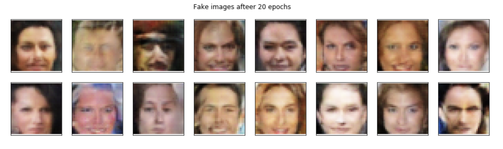
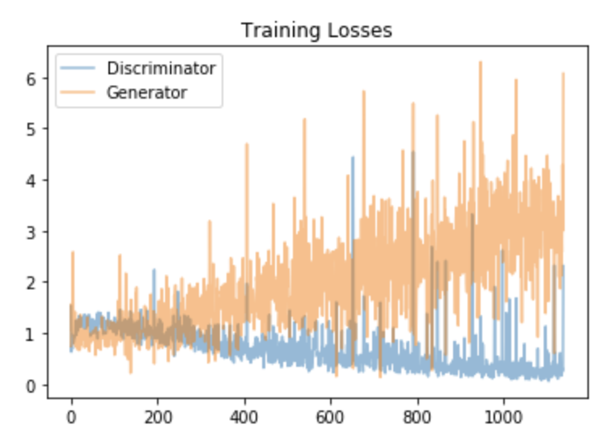

# GAN-generate-white-faces
Used Generative Adversarial Networks (GANs) to generate new images of human (white celebrities) faces

## Project Overview

This project is done as a part of the Udacity's [Deep Learning Nanodegree](https://eu.udacity.com/course/deep-learning-nanodegree--nd101). The Generative Adversarial Network is trained over a preprocessed subset of [celeba dataset](https://drive.google.com/file/d/1PWYIxXk_yrGTozEpq7EOGkhzGl-T2bpT/view?usp=sharing). The trained model is then able to generate new faces.

GANs are implemented using PyTorch framework.

Fake generated faces by the project can be found in [train_samples.pkl](train_samples.pkl)

<div align="center"></div>

Training Losses:
<div align="center"></div>

## Instructions

1. Clone the repository and navigate to the downloaded folder.
	
	```	
		git clone https://github.com/bertrandlalo/GAN-generate-white-faces
		cd GAN-generate-white-faces/
	```
2. Install required dependencies using:
	
	```
		pip install -r requirements.txt
	```
3. Download the dataset zip file from [here](https://drive.google.com/file/d/1PWYIxXk_yrGTozEpq7EOGkhzGl-T2bpT/view?usp=sharing).
4. Open a terminal window and navigate to the project folder. Open the notebook using the bellow command and follow the instructions given in the notebook.
	
	```
		jupyter notebook dlnd_face_generation.ipynb
	```


## Way of improvments 

- A first (and quite easy) way of improving the model is to diversify the training image source. Hence, having only celebrity faces that are mostly white represents a bias. See [this nice paper]( https://blog.insightdatascience.com/reducing-bias-in-ai-d64bc3142ae2). 
- We could increase the number of conv and deconv layers in the discriminator and generator. But deeper also means addictionnal computation costs and time. 
- Here, the results are very pixelised, but if I increase the input size, the model 
- More epochs may be better? To be honnest, I tried a bunch of hyperparameters possibilities (until I crashed the Udacity gpu memory..) and the results is still looking quite freaky! And indeed, the discriminator keeps 'winning' the game ! 
- Also, I read a very nice [MEDIUM PAPER](https://towardsdatascience.com/10-lessons-i-learned-training-generative-adversarial-networks-gans-for-a-year-c9071159628), with the following advices:  
    - Balancing Generator and Discriminator weight updates: In some GAN papers, we can read in the implementation section that the authors used a double or triple update of the generator for each update of the discriminator.
    - Progressive model training: start with very small images and increase the size when the model is training.  
    - Adding Noise: Aparently, making the training of the discriminator more difficult is beneficial for the overall stability.
    -  Label Smoothing: Another method to penalized the discriminator is label smoothing as follow: if the label set for real images is 1, we change it to a lower value, like 0.9. This solution discourages the discriminator from being overconfident about its classification
    - TTUR for Two Time-Scale Update Rule, which simply means to choose different learning rates for the discriminator and the generator. (which I tried). They recommend choosing a higher learning rate for the discriminator and a lower one for the generator: in this way the generator has to make smaller steps to fool the discriminator and does not choose fast, not precise and not realistic solutions to win the adversarial game.


